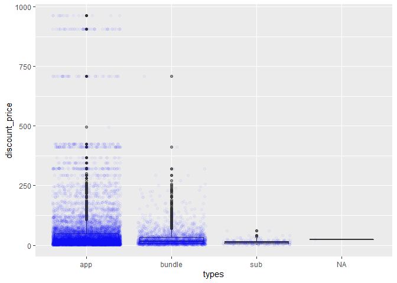
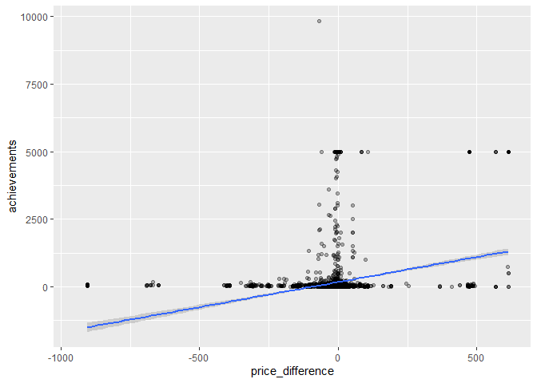
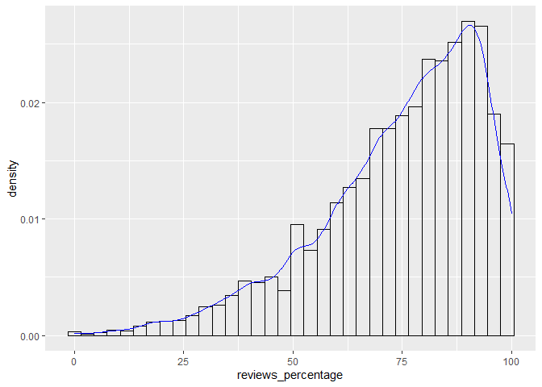
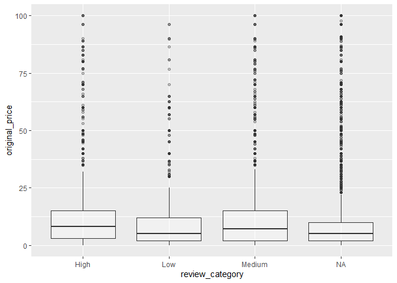

Mini Data Analysis Milestone 2
================
Yihang Chen

# Welcome back to your mini data analysis project!

This time, we will explore more in depth the concept of *tidy data*, and
hopefully investigate further into your research questions that you
defined in milestone 1.

**NOTE**: The main purpose of the mini data analysis is to integrate
what you learn in class in an analysis. Although each milestone provides
a framework for you to conduct your analysis, it’s possible that you
might find the instructions too rigid for your data set. If this is the
case, you may deviate from the instructions – just make sure you’re
demonstrating a wide range of tools and techniques taught in this class.

Begin by loading your data and the tidyverse package below:

``` r
library(datateachr) # <- might contain the data you picked!
library(tidyverse)
```

# Learning Objectives

By the end of this milestone, you should:

-   Become familiar with manipulating and summarizing your data in
    tibbles using `dplyr` and `tidyr`, with a research question in mind.
-   Understand what *tidy* data is, and how to create it. In milestone
    3, we will explore when this might be useful.
-   Generate a reproducible and clear report using R Markdown.
-   Gain a greater understanding of how to use R to answer research
    questions about your data.

**Things to keep in mind**

-   Remember to document your code, be explicit about what you are
    doing, and write notes in this markdown document when you feel that
    context is required. Create your analysis as if someone else will be
    reading it! **There will be 2.5 points reserved for reproducibility,
    readability, and repo organization.**

-   Before working on each task, you should always keep in mind the
    specific **research question** that you’re trying to answer.

# Task 1: Process and summarize your data (15 points)

From milestone 1, you should have an idea of the basic structure of your
dataset (e.g. number of rows and columns, class types, etc.). Here, we
will start investigating your data more in-depth using various data
manipulation functions.

### 1.1 (2.5 points)

First, write out the 4 research questions you defined in milestone 1
were. This will guide your work through milestone 2:

<!-------------------------- Start your work below ---------------------------->

Because in milestone1, I have already answered the four research
questions that I brought up. Therefore, I came up with four new research
question this time:

1.  Would the discount price for each type of the game different?
2.  Is there any relation between the achievement and how much the price
    is discounted compared with the original price?  
3.  What is the pattern of the review percentage?  
4.  Would the games with higher original price generally receive higher
    reviews?

<!----------------------------------------------------------------------------->

### 1.2 (10 points)

Now, for each of your four research questions, choose one task from
options 1-4 (summarizing), and one other task from 4-8 (graphing). You
should have 2 tasks done for each research question (8 total). Make sure
it makes sense to do them! (e.g. don’t use a numerical variables for a
task that needs a categorical variable.). Comment on why each task helps
(or doesn’t!) answer the corresponding research question.

Ensure that the output of each operation is printed!

**Summarizing:**

1.  Compute the *range*, *mean*, and *two other summary statistics* of
    **one numerical variable** across the groups of **one categorical
    variable** from your data.
2.  Compute the number of observations for at least one of your
    categorical variables. Do not use the function `table()`!
3.  Create a categorical variable with 3 or more groups from an existing
    numerical variable. You can use this new variable in the other
    tasks! *An example: age in years into “child, teen, adult, senior”.*
4.  Based on two categorical variables, calculate two summary statistics
    of your choosing.

**Graphing:**

5.  Create a graph out of summarized variables that has at least two
    geom layers.
6.  Create a graph of your choosing, make one of the axes logarithmic,
    and format the axes labels so that they are “pretty” or easier to
    read.
7.  Make a graph where it makes sense to customize the alpha
    transparency.
8.  Create 3 histograms out of summarized variables, with each histogram
    having different sized bins. Pick the “best” one and explain why it
    is the best.

Make sure it’s clear what research question you are doing each operation
for!

<!------------------------- Start your work below ----------------------------->

**1. Research question 1**: Would the discount price for each type of
the game different?

*For the summarizing questions, I want to discover the mean, range,
medium and standard deviation of discount price for different types of
games.*

From the analysis in the milestone 1, I know that there are three types
of steam games: app, bundle and sub. Therefore, in this analysis, I
firstly filter them into each group. I used the summary function because
it is less step while providing all the information we required.

``` r
app_games <-steam_games %>%
  filter(types == "app")  
summary(app_games$discount_price, na.rm= TRUE)
```

    ##    Min. 1st Qu.  Median    Mean 3rd Qu.    Max.    NA's 
    ##    0.00    8.99   21.05   51.87   48.88  962.60   26275

``` r
sd(app_games$discount_price,na.rm= TRUE)
```

    ## [1] 102.2909

``` r
bundle_games <-steam_games %>%
  filter(types == "bundle")  
summary(bundle_games$discount_price, na.rm= TRUE)
```

    ##    Min. 1st Qu.  Median    Mean 3rd Qu.    Max.    NA's 
    ##    0.58    7.98   17.02   26.88   32.60  707.84       2

``` r
sd(bundle_games$discount_price, na.rm= TRUE)
```

    ## [1] 35.8696

``` r
sub_games <-steam_games %>%
  filter(types == "sub")  
summary(sub_games$discount_price, na.rm= TRUE)
```

    ##    Min. 1st Qu.  Median    Mean 3rd Qu.    Max.    NA's 
    ##    0.49    4.99    9.99   11.42   14.99   59.99      12

``` r
sd(sub_games$discount_price, na.rm= TRUE)
```

    ## [1] 9.08141

From the analysis, we know that the discount price of steam games that
belong to “app” type the range is from 0.00 to 962.60. The median is
21.05. The mean is 51.87, and the standard deviation is 102.29.

For the steam games that belong to “bundle” type. The range of discount
price is from 0.58 to 707.84. The median is 17.02. The mean is 26.88.
The standard deviation is 35.86.

For the steam games that belong to “sub” type. The range of discount
price is from 0.49 to 59.99. The median is 9.99. The mean is 11.42. The
standard deviation is 9.08.

**Comment**: this task helps to answer my research question because from
this task we observe that the discount prices of steam games that belong
to different types does have very different characteristics. App games
have the most wide range of discount price, highest median and largest
standard deviation. The bundle games have the highest mean.

*For the graphing task, I will create a graph where it makes sense to
customize the alpha transparency. I will also combine two geom layers
for this analysis.*

On my graph, I will put types on the x-axis and discount price on the
y-axis.

``` r
plot1 <- steam_games %>%
  ggplot(aes(types,discount_price)) +
  geom_boxplot(alpha=0.5) +
  geom_jitter(alpha=0.03, color = "blue")

print(plot1)
```

    ## Warning: Removed 26290 rows containing non-finite values (stat_boxplot).

    ## Warning: Removed 26290 rows containing missing values (geom_point).

<!-- --> In this
graph, I made the boxplot and also plot all the points on the graph.
From the graph, we observe that most games are app games, and sub games
have the smallest range of discount prices.

**comment**: This task helps to answer my research question to some
extend because it reveals that most games are app games and sub games
have the smallest range of original prices. However, one disadvantage is
that it is hard to see the boxplot of app games because there are too
many points cluster there. I tried different transparency and adjusted
to the optimal one, considering the points need to be observed at other
types of games, but this problem still exist.

Overall, I think this task helps to discover my research question.

**2. Research question 2**: Would achievement affect how much the price
is discounted compared with the original price?

*For the summarizing questions, I want to discover the mean, range,
medium and standard deviation of the price difference, which is the
difference between the original prices and discount prices.*

From the milestone1, I made a table with original price, discount price
and price difference. Therefore here, I continue to use summary and
standard deviation function to figure out the range, mean, median and
standard deviation of the price difference.

``` r
table_with_price_difference <- steam_games %>%
  mutate(price_difference = original_price - discount_price) %>%
  select(achievements, price_difference)

summary(table_with_price_difference$price_difference)
```

    ##     Min.  1st Qu.   Median     Mean  3rd Qu.     Max.     NA's 
    ## -947.610  -29.990   -8.555  -25.753    0.300  617.760    28655

``` r
sd(table_with_price_difference$price_difference, na.rm = TRUE)
```

    ## [1] 115.92

From the task, we know that the range of price difference is from
-947.610 to 617.760. The median is -8.555. The mean is -25.753.The
standard deviation is 115.92.

**Comment**: This is actually very interesting and surprising. Usually,
people think that discount price should be lower than the original
price. However, from the analysis we observe that most games are more
expensive after having a discount, indicated by a negative price
difference. This task is very helpful when analyzing the characteristic
of price difference by supporting that the median and mean price
difference are both negative.

*For the graphing task, I will create a graph out of achievements and
price difference with one layer of points and one layer of the trend
line.*

``` r
plot2 <- steam_games %>%
  mutate(price_difference = original_price - discount_price) %>%
  ggplot(mapping=aes(x=price_difference,y=achievements)) + 
    geom_point(alpha = 0.3)+ #<- Also chaned the transparency so repeated points can be observed. 
    geom_smooth(method = "lm")

print(plot2)
```

    ## `geom_smooth()` using formula 'y ~ x'

    ## Warning: Removed 36295 rows containing non-finite values (stat_smooth).

    ## Warning: Removed 36295 rows containing missing values (geom_point).

<!-- --> From this
task, we observe that most points are clustered around the price
difference = 0. I also added a linear line to try to figure out if there
is a linear relationship between the achievements and price difference.

**Comment**: My hypothesis was the games with higher achievement does
not need to be discounted in price, therefore, higher the achievement
will give a lower price difference. However, this task showed evidence
to reject my hypothesis. Therefore, this task is helpful because it
shows there is no linear relationship between the achievement and price
difference.

**3. Research question 3**: What is the pattern of the review
percentage?

*For the summarizing task, I would like calculate the range, mean,
median and standard deviation of the review percentage.*

In order to do that, I will firstly extract the review percentage and
total review numbers from the all_reviews column. Then calculate the
range, mean, median and standard deviation from it.

``` r
dataset1 <- steam_games %>%
  mutate(reviews_percentage = as.numeric(str_match(all_reviews, ",- \\s*(.*?)\\s*% of the")[,2])) %>%
  mutate(total_reviews =  as.numeric(gsub(",","",str_match(all_reviews, "of the \\s*(.*?)\\s* user")[,2]))) %>%
  select(id,name,types, genre, release_date, developer,achievements,original_price, discount_price, reviews_percentage, total_reviews)

summary(dataset1$reviews_percentage)
```

    ##    Min. 1st Qu.  Median    Mean 3rd Qu.    Max.    NA's 
    ##    0.00   64.00   79.00   74.71   89.00  100.00   23470

``` r
sd(dataset1$reviews_percentage, na.rm=TRUE)
```

    ## [1] 18.57508

``` r
summary(dataset1$total_reviews)
```

    ##    Min. 1st Qu.  Median    Mean 3rd Qu.    Max.    NA's 
    ##      10      23      63    1539     297 3094223   23470

``` r
sd(dataset1$total_reviews, na.rm=TRUE)
```

    ## [1] 27267.65

The range of reviews (in percentage format) is from 0.00% to 100.%. The
median is 79%. The mean is 74.71% and the standard deviation is 18.57%.

**Comment**: this task helps to reveal that the average review
percentage is above 70% and it is not too bad. The range of review
percentage is very wild though.

*For the graphing task, I will create a graph out of the review
percentage and the total review number, add the density plot so the
pattern is more obvious and customize the alpha transparency of the
histogram.*

``` r
plot3 <- dataset1 %>%
  ggplot(mapping=aes(x=reviews_percentage)) +
  geom_histogram(aes(y=..density..),color="black",,alpha=0, binwidth = 3, na.rm = TRUE) +
  geom_density(color="blue", na.rm=TRUE) 

print(plot3)
```

<!-- -->

This plot showed the distribution of the reviews in percentage. It
confirms with the previous summarizing task that the overall reviews for
steam games are fine,and suggested that the mode is around 85-90%.

**Comment**: This task is helpful to the research question and reveals
that the overall reviews(in percentage) for steam games are good.

**4. Research question 4**: Would the games with higher original price
generally receive higher reviews?

*For the summarizing question, I would like to create a categorical
variable with 3 or more groups from an existing numerical variable.*

Based on the review percentage, I will category them into a categorical
variable with groups: - Low (0,50\] - Medium (50, 80\] - High (80,100\]

``` r
dataset2_with_review_category <- dataset1 %>% 
   mutate(review_category = case_when(reviews_percentage <= 50 ~ "Low",
                                 reviews_percentage <= 80~ "Medium",
                                 reviews_percentage <= 100 ~ "High",
                                 )) 
head(dataset2_with_review_category)
```

    ## # A tibble: 6 x 12
    ##      id name    types genre   release_date developer achievements original_price
    ##   <dbl> <chr>   <chr> <chr>   <chr>        <chr>            <dbl>          <dbl>
    ## 1     1 DOOM    app   Action  May 12, 2016 id Softw~           54           20.0
    ## 2     2 PLAYER~ app   Action~ Dec 21, 2017 PUBG Cor~           37           30.0
    ## 3     3 BATTLE~ app   Action~ Apr 24, 2018 Harebrai~          128           40.0
    ## 4     4 DayZ    app   Action~ Dec 13, 2018 Bohemia ~           NA           45.0
    ## 5     5 EVE On~ app   Action~ May 6, 2003  CCP                 NA            0  
    ## 6     6 Grand ~ bund~ Action~ NaN          Rockstar~           NA           NA  
    ## # ... with 4 more variables: discount_price <dbl>, reviews_percentage <dbl>,
    ## #   total_reviews <dbl>, review_category <chr>

**Comment**: By doing the first step- categorize the reviews_percentage
into 3 groups, this task can help to study the research question in the
following step that plot the review categories with original price as
shown below.

*For the graphing task, I will create a graph out of the review category
and the original price.*

Before plotting, I will first filter the original price to smaller than
100, because this is a more affordable price for most people and will
makes the plot look more clear (otherwise, the boxplot will cluster
together and will be hard to see anything). After that, I will change
the alpha to 0.3 therefore repeated points can be identified more
easily.

``` r
plot4 <- dataset2_with_review_category %>%
  filter(original_price<100) %>%
  ggplot(mapping=aes(x=review_category,y=original_price)) + 
    geom_boxplot(alpha=0.3)

print(plot4)
```

<!-- -->

**Comment**: This plot did show something interesting that in general,
the games categorized into higher review_category did show a pattern for
higher original price. This might suggest that games with higher
original price have higher quality therefore people like it more, or
people may give higher reviews for those games that they pay more.

<!----------------------------------------------------------------------------->

### 1.3 (2.5 points)

Based on the operations that you’ve completed, how much closer are you
to answering your research questions? Think about what aspects of your
research questions remain unclear. Can your research questions be
refined, now that you’ve investigated your data a bit more? Which
research questions are yielding interesting results?

<!------------------------- Write your answer here ---------------------------->

From what I have analysis, I think the third research question (What is
the pattern of the review percentage? ) is not very specific and can be
refined a little bit. A more specific research question can be “How the
reviews are distributed and can they be categorized into a more clear
version?”.

The forth research question (Would the games with higher original price
generally receive higher reviews?) generate the most interesting result.
Before the analysis, I thought there will not be much correlation
between the price and the review. However, it indeed showed a pattern. I
think a follow-up question could be “would the discounted price change
according to the review?”. For example, those games with higher reviews
would have a more expensive “discount price” therefore the seller can
make more money out of it.

<!----------------------------------------------------------------------------->

# Task 2: Tidy your data (12.5 points)

In this task, we will do several exercises to reshape our data. The goal
here is to understand how to do this reshaping with the `tidyr` package.

A reminder of the definition of *tidy* data:

-   Each row is an **observation**
-   Each column is a **variable**
-   Each cell is a **value**

*Tidy’ing* data is sometimes necessary because it can simplify
computation. Other times it can be nice to organize data so that it can
be easier to understand when read manually.

### 2.1 (2.5 points)

Based on the definition above, can you identify if your data is tidy or
untidy? Go through all your columns, or if you have \>8 variables, just
pick 8, and explain whether the data is untidy or tidy.

<!--------------------------- Start your work below --------------------------->

Since my data has more than 8 variables, I picked 8 as shown below.

``` r
dataset3 <- dataset2_with_review_category %>%
  select(-id, -developer, -genre, -achievements)

dataset3
```

    ## # A tibble: 40,833 x 8
    ##    name        types release_date original_price discount_price reviews_percent~
    ##    <chr>       <chr> <chr>                 <dbl>          <dbl>            <dbl>
    ##  1 DOOM        app   May 12, 2016           20.0           15.0               92
    ##  2 PLAYERUNKN~ app   Dec 21, 2017           30.0           NA                 49
    ##  3 BATTLETECH  app   Apr 24, 2018           40.0           NA                 71
    ##  4 DayZ        app   Dec 13, 2018           45.0           NA                 61
    ##  5 EVE Online  app   May 6, 2003             0             NA                 74
    ##  6 Grand Thef~ bund~ NaN                    NA             35.2               NA
    ##  7 Devil May ~ app   Mar 7, 2019            60.0           70.4               92
    ##  8 Human: Fal~ app   Jul 22, 2016           15.0           17.6               91
    ##  9 They Are B~ app   Dec 12, 2017           30.0           NA                 85
    ## 10 Warhammer:~ app   May 31, 2019           50.0           NA                 44
    ## # ... with 40,823 more rows, and 2 more variables: total_reviews <dbl>,
    ## #   review_category <chr>

This dataset is somehow tidy, because for all the columns other than the
release date, fulfill the condition that - Each row is an
**observation** - Each column is a **variable** - Each cell is a
**value**

However, for the release date column, it could be tidied more. For
example, it could be separated into specific day, month and year, and
therefore each cell will only contain one value.

<!----------------------------------------------------------------------------->

### 2.2 (5 points)

Now, if your data is tidy, untidy it! Then, tidy it back to it’s
original state.

If your data is untidy, then tidy it! Then, untidy it back to it’s
original state.

Be sure to explain your reasoning for this task. Show us the “before”
and “after”.

<!--------------------------- Start your work below --------------------------->

To tidy the dataset:

``` r
dataset3 #before tidy
```

    ## # A tibble: 40,833 x 8
    ##    name        types release_date original_price discount_price reviews_percent~
    ##    <chr>       <chr> <chr>                 <dbl>          <dbl>            <dbl>
    ##  1 DOOM        app   May 12, 2016           20.0           15.0               92
    ##  2 PLAYERUNKN~ app   Dec 21, 2017           30.0           NA                 49
    ##  3 BATTLETECH  app   Apr 24, 2018           40.0           NA                 71
    ##  4 DayZ        app   Dec 13, 2018           45.0           NA                 61
    ##  5 EVE Online  app   May 6, 2003             0             NA                 74
    ##  6 Grand Thef~ bund~ NaN                    NA             35.2               NA
    ##  7 Devil May ~ app   Mar 7, 2019            60.0           70.4               92
    ##  8 Human: Fal~ app   Jul 22, 2016           15.0           17.6               91
    ##  9 They Are B~ app   Dec 12, 2017           30.0           NA                 85
    ## 10 Warhammer:~ app   May 31, 2019           50.0           NA                 44
    ## # ... with 40,823 more rows, and 2 more variables: total_reviews <dbl>,
    ## #   review_category <chr>

``` r
tidy1 <- dataset3 %>% 
  separate(release_date, into = c("date", "release_year"), sep=",") %>%
  separate(date, into = c("release_month", "release_day"), sep=" ")
```

    ## Warning: Expected 2 pieces. Additional pieces discarded in 1 rows [36325].

    ## Warning: Expected 2 pieces. Missing pieces filled with `NA` in 4745 rows [6,
    ## 16, 26, 40, 45, 58, 64, 67, 69, 75, 82, 87, 103, 106, 107, 115, 120, 134, 136,
    ## 146, ...].

    ## Warning: Expected 2 pieces. Additional pieces discarded in 170 rows [14357,
    ## 30949, 31174, 31230, 31237, 31272, 31429, 31469, 31476, 31729, 31763, 31818,
    ## 32326, 32332, 32606, 32713, 32745, 32785, 32868, 32901, ...].

    ## Warning: Expected 2 pieces. Missing pieces filled with `NA` in 3771 rows [6,
    ## 16, 26, 40, 45, 58, 64, 67, 69, 75, 82, 87, 103, 106, 107, 115, 120, 134, 136,
    ## 146, ...].

``` r
#I did not drop NA values because I think it is important to keep them there, as it shows information such as the release date or the original price are not available for those specific games. 

tidy1 #after tidy
```

    ## # A tibble: 40,833 x 10
    ##    name              types release_month release_day release_year original_price
    ##    <chr>             <chr> <chr>         <chr>       <chr>                 <dbl>
    ##  1 DOOM              app   May           12          " 2016"                20.0
    ##  2 PLAYERUNKNOWN'S ~ app   Dec           21          " 2017"                30.0
    ##  3 BATTLETECH        app   Apr           24          " 2018"                40.0
    ##  4 DayZ              app   Dec           13          " 2018"                45.0
    ##  5 EVE Online        app   May           6           " 2003"                 0  
    ##  6 Grand Theft Auto~ bund~ NaN           <NA>         <NA>                  NA  
    ##  7 Devil May Cry 5   app   Mar           7           " 2019"                60.0
    ##  8 Human: Fall Flat  app   Jul           22          " 2016"                15.0
    ##  9 They Are Billions app   Dec           12          " 2017"                30.0
    ## 10 Warhammer: Chaos~ app   May           31          " 2019"                50.0
    ## # ... with 40,823 more rows, and 4 more variables: discount_price <dbl>,
    ## #   reviews_percentage <dbl>, total_reviews <dbl>, review_category <chr>

To untidy the dataset back:

``` r
tidy1 #before untidy back
```

    ## # A tibble: 40,833 x 10
    ##    name              types release_month release_day release_year original_price
    ##    <chr>             <chr> <chr>         <chr>       <chr>                 <dbl>
    ##  1 DOOM              app   May           12          " 2016"                20.0
    ##  2 PLAYERUNKNOWN'S ~ app   Dec           21          " 2017"                30.0
    ##  3 BATTLETECH        app   Apr           24          " 2018"                40.0
    ##  4 DayZ              app   Dec           13          " 2018"                45.0
    ##  5 EVE Online        app   May           6           " 2003"                 0  
    ##  6 Grand Theft Auto~ bund~ NaN           <NA>         <NA>                  NA  
    ##  7 Devil May Cry 5   app   Mar           7           " 2019"                60.0
    ##  8 Human: Fall Flat  app   Jul           22          " 2016"                15.0
    ##  9 They Are Billions app   Dec           12          " 2017"                30.0
    ## 10 Warhammer: Chaos~ app   May           31          " 2019"                50.0
    ## # ... with 40,823 more rows, and 4 more variables: discount_price <dbl>,
    ## #   reviews_percentage <dbl>, total_reviews <dbl>, review_category <chr>

``` r
untidy_back <- tidy1 %>%  
  unite(col = "date", c(release_month, release_day), sep = " ") %>%
  unite(col= "release_date", c(date, release_year), sep =",")

untidy_back #after untidy back
```

    ## # A tibble: 40,833 x 8
    ##    name        types release_date original_price discount_price reviews_percent~
    ##    <chr>       <chr> <chr>                 <dbl>          <dbl>            <dbl>
    ##  1 DOOM        app   May 12, 2016           20.0           15.0               92
    ##  2 PLAYERUNKN~ app   Dec 21, 2017           30.0           NA                 49
    ##  3 BATTLETECH  app   Apr 24, 2018           40.0           NA                 71
    ##  4 DayZ        app   Dec 13, 2018           45.0           NA                 61
    ##  5 EVE Online  app   May 6, 2003             0             NA                 74
    ##  6 Grand Thef~ bund~ NaN NA,NA              NA             35.2               NA
    ##  7 Devil May ~ app   Mar 7, 2019            60.0           70.4               92
    ##  8 Human: Fal~ app   Jul 22, 2016           15.0           17.6               91
    ##  9 They Are B~ app   Dec 12, 2017           30.0           NA                 85
    ## 10 Warhammer:~ app   May 31, 2019           50.0           NA                 44
    ## # ... with 40,823 more rows, and 2 more variables: total_reviews <dbl>,
    ## #   review_category <chr>

<!----------------------------------------------------------------------------->

### 2.3 (5 points)

Now, you should be more familiar with your data, and also have made
progress in answering your research questions. Based on your interest,
and your analyses, pick 2 of the 4 research questions to continue your
analysis in milestone 3, and explain your decision.

Try to choose a version of your data that you think will be appropriate
to answer these 2 questions in milestone 3. Use between 4 and 8
functions that we’ve covered so far (i.e. by filtering, cleaning,
tidy’ing, dropping irrelvant columns, etc.).

<!--------------------------- Start your work below --------------------------->

For my analysis in milestone3, I pick the following two research
questions: 3. What is the pattern of the review percentage?  
4. Would the games with higher original price generally receive higher
reviews?

The reason why I chose this two research question is because that there
is not much analysis about the relationship between reviews and other
factors so far (except for the relationship with the original price,
which also generated interesting results and should be able to ask some
follow-up questions). Therefore, in my milestone 3, I would like to
mainly work with those two question.

``` r
dataset_for_milestone3 <- steam_games %>%
  mutate(price_difference = original_price - discount_price) %>%
  mutate(reviews_percentage = as.numeric(str_match(all_reviews, ",- \\s*(.*?)\\s*% of the")[,2])) %>%
  mutate(total_reviews =  as.numeric(gsub(",","",str_match(all_reviews, "of the \\s*(.*?)\\s* user")[,2]))) %>%
  mutate(review_category = case_when(reviews_percentage <= 50 ~ "Low",
                                 reviews_percentage <= 80~ "Medium",
                                 reviews_percentage <= 100 ~ "High")) %>%
  filter(original_price<100) %>%
  separate(release_date, into = c("date", "release_year"), sep=",") %>%
  separate(date, into = c("release_month", "release_day"), sep=" ") %>%
  select(name, types,achievements, release_day, release_month, release_year, original_price, discount_price, price_difference, reviews_percentage, total_reviews)
```

    ## Warning: Expected 2 pieces. Missing pieces filled with `NA` in 723 rows [37, 59,
    ## 78, 96, 121, 159, 170, 182, 193, 204, 214, 234, 254, 298, 317, 350, 370, 384,
    ## 387, 490, ...].

    ## Warning: Expected 2 pieces. Additional pieces discarded in 7 rows [29169, 31487,
    ## 32055, 32303, 34095, 34627, 34642].

    ## Warning: Expected 2 pieces. Missing pieces filled with `NA` in 669 rows [37, 59,
    ## 78, 96, 121, 159, 170, 182, 193, 204, 214, 234, 254, 298, 317, 350, 370, 384,
    ## 387, 490, ...].

``` r
head(dataset_for_milestone3) 
```

    ## # A tibble: 6 x 11
    ##   name  types achievements release_day release_month release_year original_price
    ##   <chr> <chr>        <dbl> <chr>       <chr>         <chr>                 <dbl>
    ## 1 DOOM  app             54 12          May           " 2016"                20.0
    ## 2 PLAY~ app             37 21          Dec           " 2017"                30.0
    ## 3 BATT~ app            128 24          Apr           " 2018"                40.0
    ## 4 DayZ  app             NA 13          Dec           " 2018"                45.0
    ## 5 EVE ~ app             NA 6           May           " 2003"                 0  
    ## 6 Devi~ app             51 7           Mar           " 2019"                60.0
    ## # ... with 4 more variables: discount_price <dbl>, price_difference <dbl>,
    ## #   reviews_percentage <dbl>, total_reviews <dbl>

<!----------------------------------------------------------------------------->

*When you are done, knit an `md` file. This is what we will mark! Make
sure to open it and check that everything has knitted correctly before
submitting your tagged release.*

### Attribution

Thanks to Victor Yuan for mostly putting this together.
